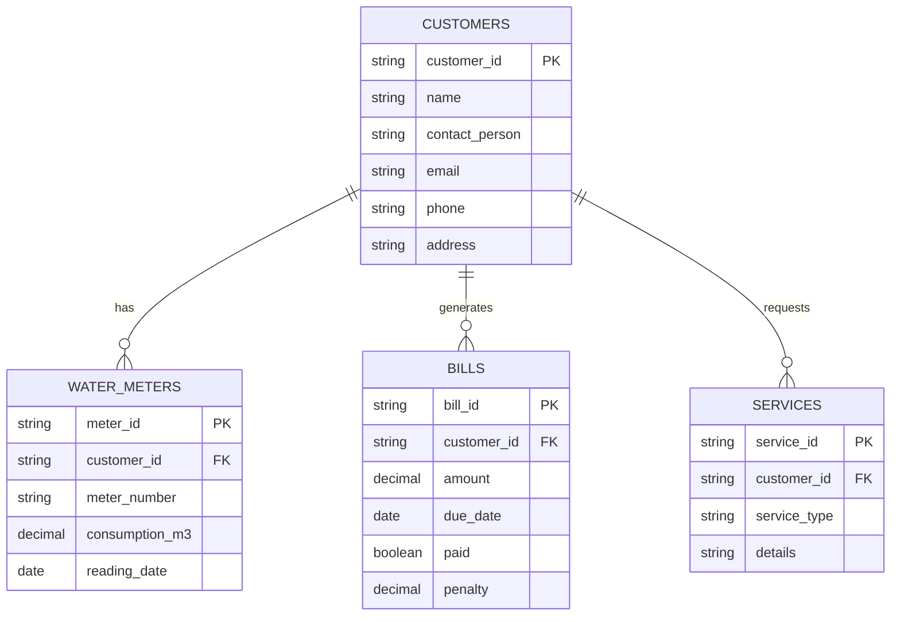
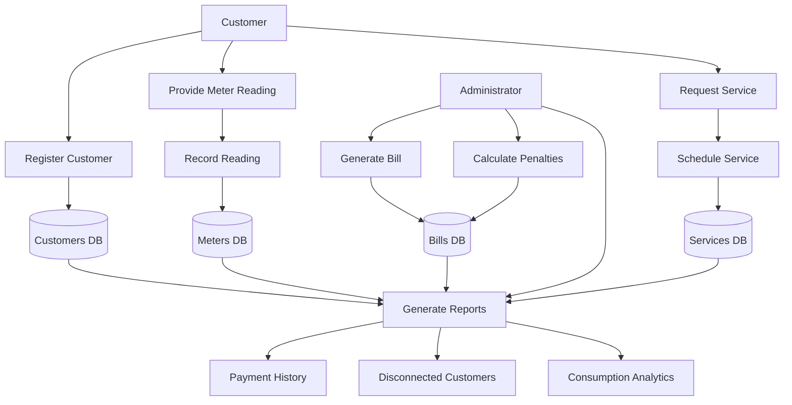

# MUWACA Water Billing System

**2026 KCSE Computer Studies Project (Paper 451/3)** - Modified Implementation

It is a significant practical examination for Form Four students in Kenya, requiring them to design and implement a database information system.

## What is the MUWACA Water Billing System?

The project focuses on a fictional organization called **MUWACA WATER ENTERPRISES**, which provides water supply and manages billing for residential and commercial customers across Kenya.

As a student, you are required to build a system that can handle the following:

* **Customer Registration:** Managing details of residential and commercial water customers.
* **Meter Management:** Tracking water meters and monthly consumption readings (in cubic meters - m³).
* **Financial Tracking:** Automating monthly billing, processing payments, and calculating a **10% monthly penalty** for overdue balances.
* **Infrastructure:** Managing water pipes, valves, and maintenance/repair services.
* **Reporting:** Generating professional reports like payment histories, disconnected customers, and consumption analytics.

## Key Project Milestones

The project is typically split into two main parts:

| Milestone | Deliverables |
| :--- | :--- |
| **Milestone 1** | **System Documentation:** Problem analysis, objectives, Entity Relationship Diagrams (ERD), Data Flow Diagrams (DFD), and database normalization (up to 3NF). |
| **Milestone 2** | **Implementation:** The actual working database with tables, relationships, user-friendly forms, complex queries, and reports. |

## Important Details for Students

* **Software:** Most schools use Microsoft Access 2016 or later.
* **Timeline:** The project usually runs from January to July of the exam year.
* **Grading:** It contributes a large portion of the final Computer Studies grade, so documentation and a functional "Switchboard" (navigation menu) are crucial for high marks.

## System Analysis and Design

### Problem Analysis
MUWACA WATER ENTERPRISES needs a system to manage customer subscriptions, meter readings, billing, and infrastructure services. Manual processes are inefficient, leading to errors in billing and service tracking. The system must automate these processes, ensure data integrity, and provide reporting capabilities.

### Objectives
- Register and manage customer information.
- Record and track water meter readings (consumption in m³).
- Generate and track bills with automatic penalty calculations.
- Schedule and manage water infrastructure services.
- Generate reports for decision-making.

### Entity Relationship Diagram (ERD)

### Database Normalization (3NF)
The database is normalized to Third Normal Form (3NF):

1. **First Normal Form (1NF):** All attributes are atomic, no repeating groups.
2. **Second Normal Form (2NF):** All non-key attributes are fully dependent on the primary key.
3. **Third Normal Form (3NF):** No transitive dependencies exist.

- **CUSTOMERS Table:** All attributes (name, contact_person, email, phone, address) depend directly on customer_id.
- **WATER_METERS Table:** meter_number, consumption_m3, and reading_date depend on meter_id; customer_id is a foreign key.
- **BILLS Table:** amount, due_date, paid, penalty depend on bill_id; customer_id is a foreign key.
- **SERVICES Table:** service_type and details depend on service_id; customer_id is a foreign key.

No transitive dependencies (e.g., no attribute depends on another non-key attribute).

### Data Flow Diagram (DFD)

## Implementation

### Web Application with Backend

The system is implemented as a full-stack web application:

- **Frontend:** HTML, CSS, JavaScript (served on port 8000)
- **Backend:** Node.js with Express and SQLite database (running on port 3000)

#### Running the Application

1. Install dependencies: `npm install`
2. Start the backend: `npm start` (runs on http://localhost:3000)
3. Serve the frontend: `python3 -m http.server 8000` (runs on http://localhost:8000)
4. Open http://localhost:8000 in your browser

#### Features Implemented

- **Switchboard Navigation:** Home page with clickable buttons for easy access to all modules
- **Customer Management:** Register, edit, delete customers with full CRUD operations
- **Meter Management:** Record and manage water meter readings with consumption tracking (m³)
- **Financial Tracking:** Generate bills, calculate 10% monthly penalties for overdue balances, mark payments
- **Infrastructure:** Schedule water pipe installations, meter installations, maintenance, and repairs
- **Reports:** Payment history, disconnected customers, and consumption analytics
- **Database:** SQLite with proper relationships and normalization (3NF)

### Database Schema

The SQLite database includes the following tables:
- `customers`: Customer information
- `water_meters`: Meter readings and consumption tracking
- `bills`: Billing records with penalty calculations
- `services`: Infrastructure and maintenance services

All tables are normalized to 3NF with proper foreign key relationships.